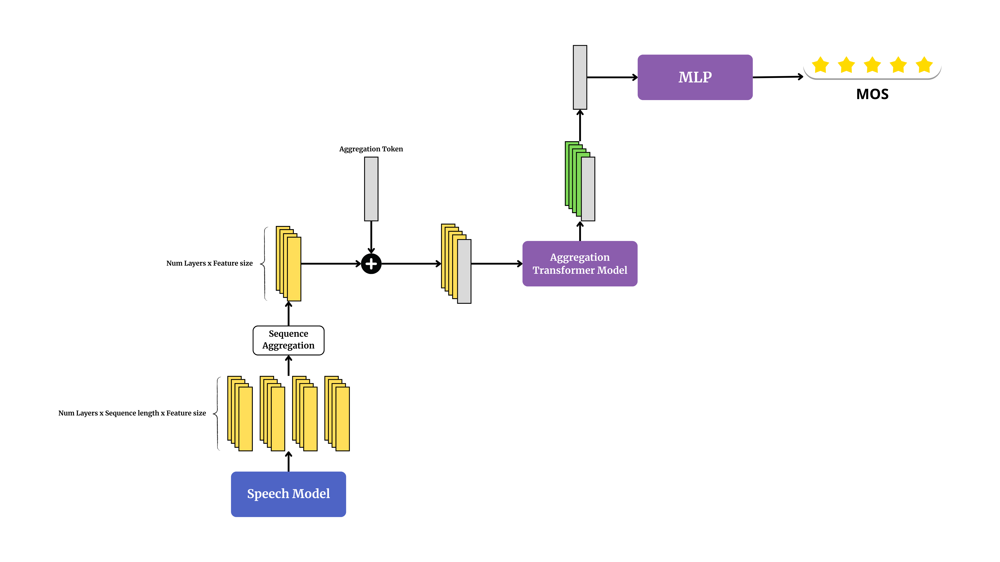

# CALMOS: Cross-layer Aggregation Leveraging Mean Opinion Scores

## Prerequisites
    - *Operating System*: Ubuntu (tested on Ubuntu XX.XX)
    - *Python Version*: Python 3.10.14

## Instalation

Install the required dependencies using the following command:

```
pip install -r requirements.txt --extra-index-url https://download.pytorch.org/whl/cu121
```

## Model Architecture

